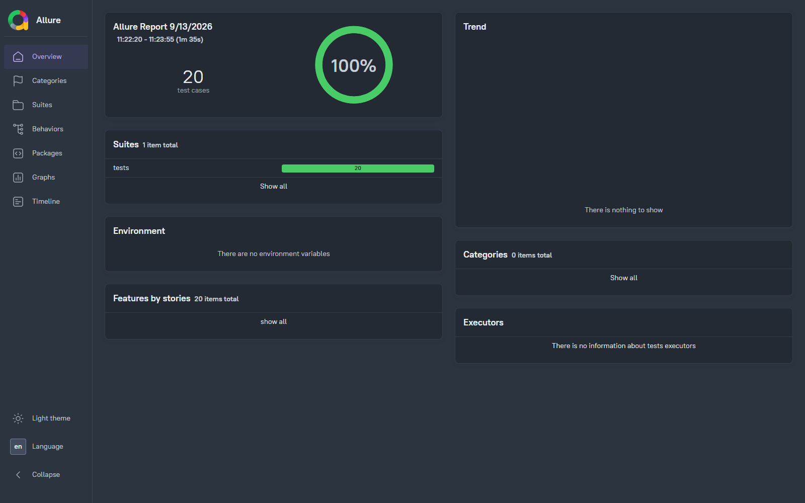
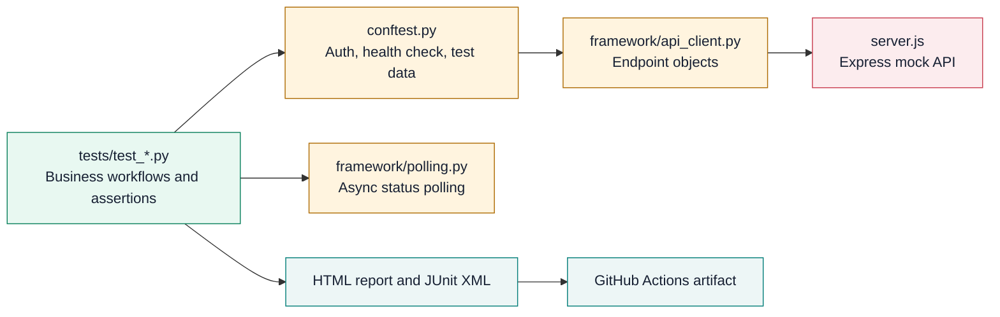

# QA API Test Automation Assignment

A production-oriented API automation framework for the supplied stateful Express mock service. It validates authentication, dependent order workflows, real asynchronous state changes, long-running export processing, and CSV download behavior.

The repository is self-contained: it includes the mock server, Python test suite, Allure reporting, JUnit output, and a GitHub Actions workflow.

## Latest Test Report

The final full local verification completed with all 20 test cases passing. pytest writes Allure result data on every run; the interactive dashboard is generated from that data and is also produced by GitHub Actions. The screenshot below is a reference Allure dashboard from an earlier all-passing run; generate a fresh dashboard after any run with `npm run allure:generate`.



## Contents

- [Latest Test Report](#latest-test-report)
- [Technology](#technology)
- [Architecture](#architecture)
- [Prerequisites](#prerequisites)
- [Quick Start](#quick-start)
- [Project Structure](#project-structure)
- [Configuration](#configuration)
- [Run the Test Suite](#run-the-test-suite)
- [Postman Collection](#postman-collection)
- [Reports](#reports)
- [Test Coverage](#test-coverage)
- [Async Workflow Strategy](#async-workflow-strategy)
- [Continuous Integration](#continuous-integration)
- [Troubleshooting](#troubleshooting)

## Technology

| Component | Choice | Purpose |
| --- | --- | --- |
| API mock | Node.js + Express | Runs the supplied local API contract on port `3000` |
| Test runner | pytest | Test discovery, fixtures, markers, assertions, and result output |
| HTTP client | requests | Connection-pooled API requests with explicit timeouts |
| Primary reporting | Allure | Interactive dashboard with suites, execution history, and failure details |
| Secondary reporting | pytest-html | Self-contained single-file HTML execution summary |
| CI | GitHub Actions | Installs dependencies, starts the API, runs tests, and uploads artifacts |

## Architecture

The framework uses an API Page Object Model: test files describe expected business behavior, while the API client layer owns endpoint paths, HTTP methods, headers, session reuse, and request timeouts. Shared pytest fixtures provide authentication, API readiness checks, configuration, and isolated test data. Stateful tests use bounded polling rather than fixed sleeps.



See [docs/architecture.md](docs/architecture.md) for the complete layered diagram, responsibilities, and request flow.

## Prerequisites

Install the following before starting:

- Node.js 20 or newer, including `npm`
- Python 3.10 or newer, including `pip`
- A terminal with permission to bind to local port `3000`

Confirm the tools are available:

```powershell
node --version
npm --version
python --version
```

## Quick Start

### 1. Install the mock server dependency

From the repository root, run:

```powershell
npm install
```

This installs Express from [package.json](package.json). For a clean, lockfile-based installation, use `npm ci` instead.

### 2. Create a Python virtual environment

Using a virtual environment keeps the test dependencies separate from global Python packages.

### Windows PowerShell

```powershell
python -m venv .venv
.\.venv\Scripts\Activate.ps1
python -m pip install --upgrade pip
python -m pip install -r requirements.txt
```

If PowerShell blocks virtual-environment activation, run this once in the current shell and retry:

```powershell
Set-ExecutionPolicy -Scope Process -ExecutionPolicy Bypass
```

### macOS/Linux

```bash
python3 -m venv .venv
source .venv/bin/activate
python -m pip install --upgrade pip
python -m pip install -r requirements.txt
```

### 3. Start the local mock API

Open a second terminal in the repository root and run:

```powershell
npm run start
```

The server prints:

```text
Mock API Server running at http://localhost:3000
```

Keep this terminal running while tests execute. Stop it with `Ctrl+C` after testing is complete.

### 4. Run the suite

Return to the terminal with the activated Python environment:

```powershell
python -m pytest -q --junitxml=test-results/junit.xml
```

Expected result:

```text
20 passed
```

The command creates native Allure results, a machine-readable JUnit file, and a single-file pytest HTML summary. Generate the Allure dashboard with `npm run allure:generate`.

## Manual Verification Walkthrough

Use this sequence when running the framework manually on Windows. Keep the API terminal open until every test command has finished.

### Terminal 1: Start the mock API

```powershell
Set-Location C:\Users\BiVi440\QA_API_Test_Automation_Assignment
npm install
npm run start
```

Confirm this message appears before continuing:

```text
Mock API Server running at http://localhost:3000
```

### Terminal 2: Prepare the Python test environment

```powershell
Set-Location C:\Users\BiVi440\QA_API_Test_Automation_Assignment
python -m venv .venv
.\.venv\Scripts\Activate.ps1
python -m pip install --upgrade pip
python -m pip install -r requirements.txt
```

If script execution is blocked, run the following once in Terminal 2, then activate the environment again:

```powershell
Set-ExecutionPolicy -Scope Process -ExecutionPolicy Bypass
.\.venv\Scripts\Activate.ps1
```

### Run each test area

Start with authentication to confirm the mock API and Python client are connected:

```powershell
python -m pytest tests/test_auth.py -q
```

Expected result: `8 passed`.

Next, run the stateful order workflows:

```powershell
python -m pytest tests/test_orders.py -q
```

Expected result: `7 passed` in roughly 35 seconds.

Then run the export workflows. The completed-export test deliberately waits for the real 60-second server transition:

```powershell
python -m pytest tests/test_exports.py -q
```

Expected result: `5 passed` in roughly 62 seconds.

### Run the final result

After the focused runs pass, execute the entire suite and generate its JUnit artifact:

```powershell
python -m pytest -q --junitxml=test-results/junit.xml
```

Expected result: `20 passed` in roughly 95 seconds. The same run generates `allure-results/`, `reports/api-test-report.html`, and `test-results/junit.xml`.

Generate and open the primary Allure dashboard:

```powershell
npm run allure:generate
npm run allure:open
```

When finished, return to Terminal 1 and press `Ctrl+C` to stop the mock API.

## Project Structure

```text
.
|-- .github/workflows/api-tests.yml    # GitHub Actions workflow
|-- assets/
|   `-- report_style.css               # Embedded HTML report theme
|-- docs/
|   |-- architecture.md                # Full framework architecture diagram
|   |-- allure-report-preview.png      # Reference screenshot of an all-passing Allure dashboard
|   `-- report-preview.png             # Screenshot of the pytest HTML report
|-- framework/
|   |-- api_client.py                  # API endpoint objects and shared HTTP client
|   `-- polling.py                     # Deadline-based async polling helper
|-- tests/
|   |-- test_auth.py                   # Login and authorization tests
|   |-- test_orders.py                 # Order creation, lifecycle, and cancellation tests
|   `-- test_exports.py                # Export processing and CSV download tests
|-- conftest.py                        # Shared configuration and pytest fixtures
|-- package.json                       # Mock server scripts and Node dependencies
|-- postman/
|   `-- QA-API-Test-Automation.postman_collection.json  # Import-ready API collection
|-- pytest.ini                         # pytest discovery, marker, and report settings
|-- requirements.txt                   # Python test/report dependencies
|-- server.js                          # Supplied Express mock API
`-- README.md                          # Setup and framework documentation
```

Generated files are excluded from source control:

```text
reports/api-test-report.html           # Visual execution report
allure-results/                        # Raw Allure result data
allure-report/                         # Generated Allure dashboard
test-results/junit.xml                 # JUnit XML result artifact
node_modules/                          # Node.js dependencies
.venv/                                 # Local Python virtual environment
```

## Configuration

### Base URL

Tests use `BASE_URL` and default to `http://localhost:3000/v1`.

### Set BASE_URL in Windows PowerShell

```powershell
$env:BASE_URL = "http://localhost:3000/v1"
python -m pytest -q
```

### Set BASE_URL in macOS/Linux

```bash
BASE_URL="http://localhost:3000/v1" python -m pytest -q
```

`BASE_URL` must include the `/v1` API prefix. This lets the framework run against another environment implementing the same API contract without editing test code.

### Request Handling

- Every API call uses an explicit five-second HTTP timeout.
- A session-scoped `requests.Session` reuses HTTP connections across tests.
- The API Page Object Model in `framework/api_client.py` centralizes endpoint paths, HTTP methods, protected-route headers, and request execution.
- Test modules interact with `auth`, `orders`, and `exports` endpoint objects rather than assembling URLs or issuing raw HTTP requests.
- Before the first request, the framework posts to `/auth/login` as a health check.
- If the API is unavailable, test setup fails early with the exact server-start command needed to recover.
- The authenticated fixture obtains a Bearer token once per test session and supplies it to protected endpoints.

### Test Data Isolation

Each order test uses a generated UUID for its `customerId` and `X-Correlation-ID`. This avoids collisions when tests are repeated or executed in CI. Order line items are intentionally deterministic, so the expected calculated total is always `40`.

## Run the Test Suite

pytest is configured in [pytest.ini](pytest.ini) to automatically create Allure results and a self-contained pytest HTML summary. Any pytest command below refreshes `allure-results/` and overwrites `reports/api-test-report.html`.

### Full suite

```powershell
python -m pytest -q --junitxml=test-results/junit.xml
```

This is the submission and CI command. It executes all tests, including the 60-second export workflow. A typical complete run takes about 95 seconds.

### Fast feedback suite

Exclude only the long-running export completion test:

```powershell
python -m pytest -m "not slow" -q
```

This retains all authentication, order, export-creation, pending-download, and error-path coverage while skipping the real 60-second wait.

### Run one endpoint area

```powershell
python -m pytest tests/test_auth.py -q
python -m pytest tests/test_orders.py -q
python -m pytest tests/test_exports.py -q
```

### Run tests by marker

Each test has endpoint (`auth`, `orders`, or `exports`) and scenario markers. `smoke` selects critical successful workflows, `negative` selects validation and error-path tests, `lifecycle` selects state-transition workflows, and `slow` identifies the 60-second export completion test. Combine markers with pytest expressions when selecting a targeted test run:

```powershell
python -m pytest -m auth -q
python -m pytest -m orders -q
python -m pytest -m exports -q
python -m pytest -m "exports and slow" -q
python -m pytest -m smoke -q
python -m pytest -m negative -q
python -m pytest -m lifecycle -q
```

### Run the long-running export test only

```powershell
python -m pytest tests/test_exports.py -m slow -q
```

### Useful pytest options

```powershell
# Show each test name and its outcome.
python -m pytest -v

# Stop at the first failed test.
python -m pytest -x

# Re-run only the test named in the expression.
python -m pytest -k "completed_export"

# Show local variables for failures.
python -m pytest -l
```

## Postman Collection

An import-ready Postman collection is available at [postman/QA-API-Test-Automation.postman_collection.json](postman/QA-API-Test-Automation.postman_collection.json). It mirrors the core authentication, order, export, and error-path coverage in a visual format.

### Import and configure

1. Start the local API with `npm run start`.
2. Open Postman and select **Import**.
3. Choose the collection JSON file from the `postman/` directory.
4. Open the imported collection and confirm the collection variable `baseUrl` is `http://localhost:3000/v1`.
5. Run **Login - Save Bearer Token** first. Its test script stores the returned token as `bearerToken` for protected requests.

The collection automatically stores these values as it runs:

| Variable | Set by | Used by |
| --- | --- | --- |
| `bearerToken` | Login request | Every protected request |
| `correlationId` | Create-order pre-request script | Create-order request |
| `customerId` | Create-order pre-request script | Create-order request |
| `orderId` | Create-order test script | Dependent order status requests |
| `exportJobId` | Create-export test script | Dependent export status and download requests |

### Run workflow requests

Run the folders in this order: **01 - Authentication**, **02 - Orders**, then **03 - Exports**. Each request includes Postman test assertions for its expected HTTP status and response contract.

For stateful workflow checks, use the Collection Runner and set a request delay:

| Workflow | Required delay before the named request | Expected state |
| --- | --- | --- |
| Order processing | 5 seconds before **Get Order - PROCESSING** | `PROCESSING` |
| Order completion | 15 seconds from order creation before **Get Order - COMPLETED** | `COMPLETED` |
| Export completion | 60 seconds from export creation before **Get Export - COMPLETED** | `COMPLETED` with a download URL |

Postman does not use the pytest polling helper, so these lifecycle requests are deliberately named with their required timing. For a fully automated stateful run with bounded polling and CI artifacts, use the pytest suite.

## Reports

### Allure report

pytest writes native Allure result data to `allure-results/` on every run. Generate the interactive Allure dashboard with the project-local Allure CLI:

```powershell
npm run allure:generate
```

Open the generated dashboard in a local browser session:

```powershell
npm run allure:open
```

The dashboard is generated in `allure-report/`. Its `index.html` can also be opened directly after generation:

```powershell
Start-Process allure-report/index.html
```

Allure provides a richer execution view than a flat report, including test-suite grouping, status trends, durations, environment details, and expanded failure diagnostics. No global Allure installation is required because the CLI is installed locally through `npm install`.

### pytest HTML report

Every test run generates [reports/api-test-report.html](reports/api-test-report.html). It is a single, portable HTML file with all CSS embedded, so it can be opened or shared without a web server.

### Open the report

After any pytest execution, open `reports/api-test-report.html` in a browser. In VS Code, use the Explorer to open the file or run:

```powershell
Start-Process reports/api-test-report.html
```

### Report contents

- A clear pass/fail/skip summary and execution duration
- Environment metadata from pytest
- One row per test, grouped by result status
- Expandable details for failures and captured logs
- Interactive result filters supplied by `pytest-html`
- A responsive, custom visual theme with high-contrast pass, failure, and skipped states

### Generate a report with a different name

The default path is configured in [pytest.ini](pytest.ini). Override it for a specific run when retaining multiple execution results:

```powershell
python -m pytest -q --html=reports/regression-report.html --self-contained-html --css=assets/report_style.css
```

### JUnit XML report

Generate JUnit XML for CI systems and test management integrations:

```powershell
python -m pytest -q --junitxml=test-results/junit.xml
```

The XML includes one test case per pytest test and is uploaded by the GitHub Actions workflow with the Allure dashboard, Allure raw results, and pytest HTML report.

## Test Coverage

| Endpoint | Behavior verified |
| --- | --- |
| `POST /v1/auth/login` | Valid credentials return `200`, a token, and `expiresIn: 3600`; missing credentials return `400` |
| Protected routes | Every protected endpoint rejects missing Bearer authorization with `401` and the documented error payload |
| `POST /v1/orders` | Requires `X-Correlation-ID`; validates payload; returns `202`, `PENDING`, an order ID, timestamp, and calculated total |
| `GET /v1/orders/:orderId` | Returns persisted order fields; unknown IDs return `404`; triggers and verifies status transitions |
| `DELETE /v1/orders/:orderId` | Cancels a `PENDING` or `PROCESSING` order; cancelled state persists; completed orders return `409`; unknown IDs return `404` |
| `POST /v1/exports` | Returns `202`, `PROCESSING`, a job ID, and a five-second polling interval |
| `GET /v1/exports/:jobId` | Returns processing status with no URL initially; later returns `COMPLETED` and the download path; unknown IDs return `404` |
| `GET /v1/exports/:jobId/download` | Returns `400` before completion; returns `200`, `text/csv`, content-disposition, and exact CSV data after completion; unknown IDs return `404` |

## Async Workflow Strategy

The target API is intentionally stateful. Order and export tests therefore do not depend on arbitrary long sleeps.

### Order lifecycle

The mock server calculates state when an order is fetched:

```text
Immediately:   PENDING
After 5 sec:   PROCESSING
After 15 sec:  COMPLETED
```

The test suite verifies all three states. It polls the order endpoint every second, with an eight-second deadline for `PROCESSING` and an 18-second deadline for `COMPLETED`.

### Export lifecycle

The export service remains `PROCESSING` for 60 seconds and advertises a five-second polling interval:

```text
Immediately:   PROCESSING, downloadUrl = null
After 60 sec:  COMPLETED, downloadUrl is available
```

The slow test uses the service-provided five-second polling cadence and a 70-second deadline. If the expected status is not reached, the assertion includes the last received HTTP status and response body, making asynchronous failures diagnosable from the terminal and HTML report.

## Continuous Integration

The workflow at [.github/workflows/api-tests.yml](.github/workflows/api-tests.yml) runs on every push and pull request.

It performs the following sequence:

1. Checks out the repository.
2. Configures Node.js 24 and Python 3.13.
3. Installs dependencies using `npm ci` and `pip`.
4. Starts the local Express mock server.
5. Probes the login endpoint until the API is ready.
6. Runs the complete pytest suite with JUnit XML output.
7. Generates an Allure dashboard from the results, even when a test fails.
8. Uploads `allure-report/`, `allure-results/`, `test-results/junit.xml`, and `reports/api-test-report.html` as the `api-test-results` workflow artifact.

After a GitHub Actions run, open the run page, then download the `api-test-results` artifact. Open `allure-report/index.html` locally to review the Allure dashboard.

## Troubleshooting

### `Mock API is unavailable` during setup

The test framework cannot reach the configured `BASE_URL`.

1. Confirm the server is running in a separate terminal with `npm run start`.
2. Confirm port `3000` is free and the server startup message is visible.
3. Confirm `BASE_URL` includes `/v1`, for example `http://localhost:3000/v1`.
4. Re-run the failing command.

### `EADDRINUSE: address already in use :::3000`

Another process owns port `3000`. Stop the existing server or identify the process:

```powershell
Get-NetTCPConnection -LocalPort 3000 | Select-Object -ExpandProperty OwningProcess
```

Stop the returned process only after confirming it is safe to stop:

```powershell
Stop-Process -Id <process-id>
```

### `ModuleNotFoundError` or `pytest: command not found`

Activate the virtual environment and reinstall dependencies:

```powershell
.\.venv\Scripts\Activate.ps1
python -m pip install -r requirements.txt
python -m pytest --version
```

Using `python -m pytest` is preferred because it guarantees pytest runs under the active Python interpreter.

### The HTML report is not present

Install dependencies again and run pytest from the repository root:

```powershell
python -m pip install -r requirements.txt
python -m pytest tests/test_auth.py -q
```

The generated file is `reports/api-test-report.html`. The `reports` directory is created automatically by pytest-html.

### The export test times out

The mock server requires a real 60 seconds before marking the job complete. Do not stop or restart the server during this test. Run the export test by itself to isolate the issue:

```powershell
python -m pytest tests/test_exports.py -m slow -v
```

Check the HTML report's expanded test details for the final response returned before the deadline.

### A local test passes but CI fails

Use clean dependency installation locally to approximate CI:

```powershell
Remove-Item -Recurse -Force node_modules
npm ci
python -m pip install -r requirements.txt
```

Then start the server and run the full command from the workflow:

```powershell
python -m pytest -q --junitxml=test-results/junit.xml
```
