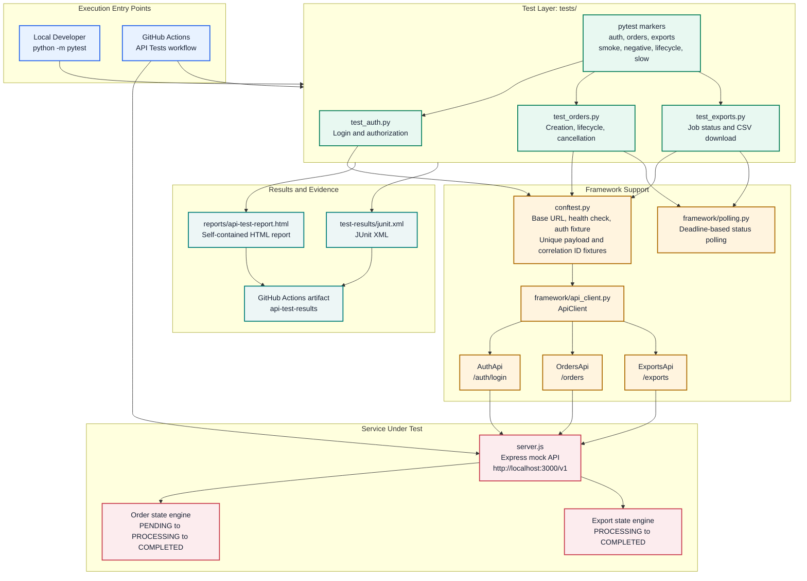

# Framework Architecture

This API automation framework separates test intent, API interaction, shared test setup, reporting, and continuous integration. The separation keeps endpoint changes localized to the API object layer while test modules stay focused on business behavior and assertions.

## Responsibilities

| Layer | Components | Responsibility |
| --- | --- | --- |
| Test layer | `tests/test_*.py` | Expresses business workflows, expected HTTP outcomes, and response assertions. |
| API object layer | `framework/api_client.py` | Centralizes endpoint paths, request methods, headers, session reuse, and five-second request timeouts. |
| Test setup | `conftest.py` | Supplies the configurable base URL, startup health check, authenticated headers, and isolated request data. |
| Async support | `framework/polling.py` | Polls status endpoints with a deadline and includes the final response in timeout failures. |
| Test selection | `pytest.ini` and decorators | Provides endpoint and scenario markers for fast, focused execution. |
| Reporting | `pytest-html`, JUnit XML, `assets/report_style.css` | Produces a portable visual report and CI-compatible machine-readable test results. |
| CI | `.github/workflows/api-tests.yml` | Installs dependencies, starts the mock API, waits for readiness, executes tests, and uploads artifacts. |

## Request Flow

1. pytest loads `conftest.py`, reads `BASE_URL`, and checks that the login endpoint is reachable.
2. The session fixture authenticates once and provides the Bearer token for protected-route tests.
3. A test invokes an endpoint object such as `api_client.orders.create(...)`; it never constructs a URL directly.
4. `ApiClient` executes the request through a shared `requests.Session` with the standard timeout.
5. Stateful tests use `wait_for_status(...)` to poll only until the required status is observed or a meaningful timeout is raised.
6. pytest writes the styled HTML report and JUnit XML after the run; GitHub Actions uploads both as `api-test-results`.
